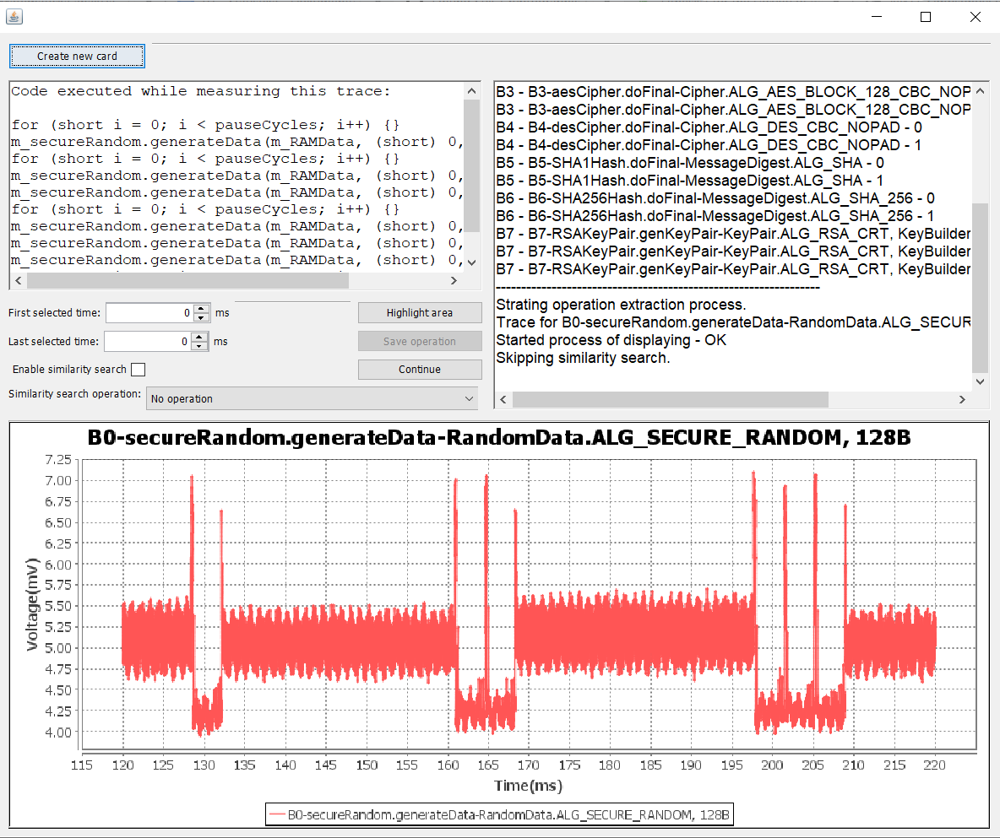

# SPA-Cryptographic-Operations-Extractor

This programme was created as a part of a Bachelor thesis.
It serves to extract power traces of cryptographic oprations measured on smart cards depedning on the delimiting operation.
It takes a folder containing CSV files of obtained power traces by using Simple Power Analysis as an input.
Each cryptographic operation should be delimited by some delimiting operation (i.e. generation of random numbers).
Applet containing functionality this programme was customized to is on the link https://github.com/martinftlsx/SBAPR-2019-JCApplet.
Brief description about the whole idea and bachelor thesis can be found on https://crocs.fi.muni.cz/research/smartcard/spadb.

**Usage**
1. In the beggining you need to have measured power traces i.e. obtained with PicoScope. Powert races  must be in CSV format and contain APDU command code i.e. generation of random numbers power trace name must contain B0.
2. You can download JAR compiled programme from Releases section.
3. In the beggining you select folder containing traces in CSV format and final folder where resulting extracted operatons should be stored.
4. Then the whole extraction process begins.
5. First power trace should be generation of random numbers as the delimiting operation.
6. You should mark the beggining and the ending of this operation by simply clicking on the chart (if you used mentioned applet there should be visible 6 same looking operations).
7. After this you must highlight marked operation (optionally you can press CTRL+H) and if the selected result is fine save this (by CTRL+S). This operation should be added to the combobox and selected, now you can turn on similarity search.
8. Now every power trace similarity search should be executed on will be processed in this way and you just check whether the result is right if yes the result is automatically saved. If the result is not right you can highlight wanted operation and simply save it.

